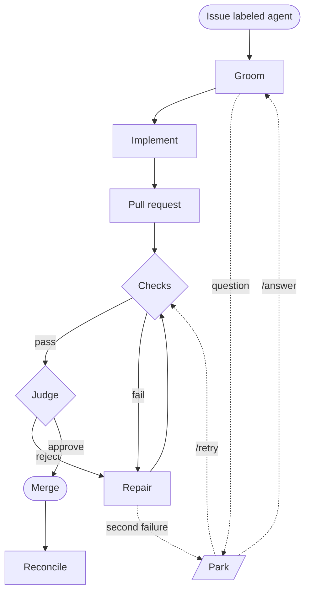

<div align="center">

# ghafk

**Works your GitHub issues while you are away from the keyboard.**

[](https://github.com/mike-diff/ghafk/actions/workflows/ci.yml)
[](go.mod)
[](LICENSE)

[How it works](#how-it-works) · [Quick start](#quick-start) · [Daily use](#daily-use) · [Configuration](docs/configuration.md) · [Troubleshooting](docs/troubleshooting.md) · [Security](docs/security.md)

</div>

Label an issue `agent`. A timer on your machine gives the issue to a coding
agent, checks the result and merges the pull request. GitHub holds all the
state, so github.com is your dashboard.

> [!WARNING]
> ghafk runs coding agents as you, on your machine. The text of the issue is
> their prompt. Read the [security model](docs/security.md) before you
> register a repository.

## How it works

On each tick, ghafk does one step for each registered repository. By
default, a tick starts every 2 minutes.



| Term | Meaning |
|---|---|
| **Groom** | An agent turns the issue into a contract, or asks you one question. |
| **Contract** | The change to make, its acceptance criteria and its commit line. |
| **Card** | One comment on the issue that shows the contract and the progress. ghafk edits it in place. |
| **Judge** | A second agent that compares the diff with the contract. |
| **Park** | ghafk stops, adds `needs-human` and tells you what to do. It does not retry alone. |
| **Reconcile** | After a merge, ghafk checks the other open issues that the change touched. |

## Quick start

- [ ] Linux with a systemd user session, or macOS
- [ ] Go 1.26 or newer, and `git` with a commit identity
- [ ] [`gh`](https://cli.github.com), logged in with `gh auth login`
- [ ] A coding agent CLI that ghafk supports. See [harness profiles](docs/configuration.md#harness-profiles).

1. Install ghafk. Go puts it in `$(go env GOPATH)/bin`. Add that folder to
   your `PATH` if your shell cannot find `ghafk`.

   ```sh
   go install github.com/mike-diff/ghafk@latest
   export PATH="$PATH:$(go env GOPATH)/bin"
   ```

2. Set the default harness and model. Then test them. `ghafk harness list`
   shows the harnesses that ghafk knows.

   ```sh
   ghafk harness default <harness> <model>
   ghafk harness test <harness> <model>
   ```

3. Register a repository. Then commit and push the file that ghafk writes.

   ```sh
   cd ~/src/your-repo
   ghafk init
   git add .ghafk/WORKFLOW.md && git commit -m "chore: configure ghafk" && git push
   ```

   ghafk also works each repository that you own where
   `.ghafk/WORKFLOW.md` is on the default branch. If ghafk runs as a
   [separate user](docs/separate-user.md), run `ghafk init` in your own
   clone and push. The engine finds the repository on its next tick. See
   [repositories](docs/configuration.md#repositories).

4. Start the timer.

   ```sh
   ghafk start
   ```

5. Label an issue `agent`, or comment `/start` on it. To get good results,
   read [how to write an issue](docs/writing-issues.md).

> [!TIP]
> The timer has no SSH agent. If you push over HTTPS, run `gh auth setup-git`.
> On Linux, run `loginctl enable-linger "$USER"` to keep the timer on after
> you log out. On macOS, the timer runs only while you are logged in.

## What happens next

ghafk checks for labeled issues on each tick. On the next tick, it adds
a card to the issue. The card shows the contract and a progress table. ghafk
edits the card at each step:

| Step | Status | Duration | Tokens | Harness |
|---|---|---|---|---|
| Groom | ✅ | 1m 52s | 115k | `<harness> <model:effort>` |
| Implement | ✅ | 2m 40s | 140k | `<harness> <model:effort>` |
| Checks | ✅ | 41s | | |
| Judge | ⏳ | | | `<harness> <model:effort>` |
| Merge | ⬜ | | | |

A small issue goes from label to merge in approximately 10 minutes. You
can change the tick interval and the columns of the table. See
[machine settings](docs/configuration.md#machine-settings).

## Daily use

Control ghafk from GitHub. Put a command at the start of a comment on the
issue or its pull request.

| Command | Result |
|---|---|
| `/start` | Starts work on the issue. |
| `/answer <text>` | Answers a question from ghafk. Grooming continues. |
| `/retry` | Continues a parked issue or pull request. |
| `/close` | Closes the issue, or closes the pull request. |
| `/stop` | Removes the labels. ghafk ignores the issue until you label it again. |

> [!NOTE]
> ghafk accepts commands only from people with write access. It adds 👍 to
> each command that it accepts.

On your machine, use `ghafk status` to see the timer, the log and each
repository. Use `ghafk stop` to stop the timer. If something does not work,
see [troubleshooting](docs/troubleshooting.md).

## Configuration

Each repository has a `.ghafk/WORKFLOW.md` file. Most repositories need
only `checks`:

```markdown
---
checks: go build ./... && go vet ./... && go test ./...
---
Use the standard library only.
```

The text after the settings block holds the rules of your repository.
ghafk adds it to the [prompt of each agent](docs/prompts.md).

The [configuration reference](docs/configuration.md) lists every setting,
label, harness profile and file. To show ghafk as a bot on GitHub,
[run it as a GitHub App](docs/github-app.md).

## Security

- Agents run as you, with your credentials and network access. To keep
  them away from your keys and other repositories, [run ghafk as its own
  Linux user](docs/separate-user.md).
- ghafk's own git commands ignore git files that an agent changes.
- Only people with write access can send commands or add prompt text.
- ghafk works only the pull requests that it opened.
- A change to `.github/` or `.ghafk/` always waits for you.
- Prompts are not controls. Use branch protection for a real gate.

Read the full [security model](docs/security.md). To report a
vulnerability, see [SECURITY.md](SECURITY.md).

<details>
<summary><b>Limits</b></summary>

- ghafk runs on Linux with systemd, and on macOS with launchd. Support for
  macOS is new. Report problems as issues.
- Each tick does one step for each repository, one repository at a time.
- Checks run on your machine. ghafk does not wait for GitHub Actions.
- The `origin` remote of the clone must be the GitHub repository.

</details>

## For agents

[llms.txt](llms.txt) lists the docs for language models. The
[ghafk skill](skills/ghafk/SKILL.md) teaches a coding agent to install,
configure and operate ghafk. To use it with Claude Code, copy
`skills/ghafk` to `.claude/skills/` in your project or home folder.

## Contributing

Each change must keep the engine able to take a real issue to a merged
pull request. [.ghafk/WORKFLOW.md](.ghafk/WORKFLOW.md) is the
configuration of this repository, and an example.

## License

[MIT](LICENSE)
